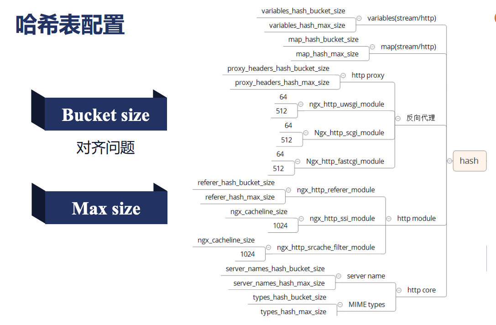

nginx架构基础
==========================================

nginx请求处理流程
------------------------------------

.. image:: ../images/nginx05.png

nginx接收流量， 通过fastcgi、tcp代理等转发后端。 
内部完成日志处理，静态文件处理，和一些状态机处理。

nginx进程结构
------------------------------------

.. image:: ../images/nginx06.png

基本是有个master进程的， 多个work进程的。 
还可能有cache manager进程和cache loader进程。

nginx进程管理
------------------------------------

**master 进程**

- 需要监控worker进程的chld信号
- 管理worker进程
- 接收控制信号 term int quit hup usr1 usr2 winch 

**work进程**

- 接收管理信号 term quit usr1 winch 

**nginx命令行**

- reload : hup 
- reopen : usr1 
- stop : term 
- quit : quit 

reload流程
------------------------------------

#. 向master发送hup信号
#. master校验conf配置
#. master打开新的端口（如果需要）
#. master进程用新的配置启动新的worker子进程。
#. master向老的worker发送quit信号
#. 老的worker进程关闭监听句柄，处理完毕当前连接结束进程。

热升级流程
------------------------------------

#. 旧nginx文件替换为新的nginx文件
#. 给master发送usr2信号
#. master修改pid文件名字，加后缀.oldbin
#. master进程使用新的nginx文件启动新的master进程
#. 向老的master发送quit信号，关闭老的master

如果要回滚的话， 可以给老的master发送hup信号， 给新的master发送quit信号即可。 

worker进程优雅退出
------------------------------------

#. 设置定时器worker_shutdown_timeout 
#. 关闭监听句柄
#. 关闭空闲连接
#. 循环关闭断开的连接
#. 退出进程

网络传输
------------------------------------
网络传输过程

.. image:: ../images/nginx07.png

tcp流与报文 

.. image:: ../images/nginx08.png

epoll高性能
--------------------------

- 每次只处理活跃连接。
- 实现层面红黑树和链表高效。

select缺点

- 每次调用selet都需要将fd集合从用户态copy到内核态，
- 在内核态遍历所有fd 
- select默认支持的文件描述符也比较小。

poll模式基本和select一致。 文件描述符支持更多。

epoll

- 线程安全的。
- 使用mmap共享用户和内核部分空间，避免来回copy.
- 基于事件驱动，注册事件的时候注册了callback回调函数的， epoll_wait只返回发生的事件。
  

请求切换
--------------------------

- apache传统web服务， 进程调度比较多。
- nginx用户态完成连接切换

nginx模块
--------------------------
主要模块

- events 
- http 
- core 
- errlog 
- mail 
- thread_poll
- stream 
- openssl

连接池
-------------------------
包含了对下游客户端的连接和对上游服务的连接。

内存池
-------------------------
connection_poll_size 内存提前分配好一批。 
大块内存使用alloc分配。

连接内存池 

请求内存池 一般4k 

- connection_poll_size
- request_poll_size

nginx进程间的通讯方式
-------------------------
信号和共享内存
通过共享内存的worker进程之间存在抢占问题， 需要引入锁机制。 内存管理对应需要slab内存管理器。

哪些需要共享内存
-------------------------
- 限流类的
- cache类
- lua使用

nginx slab 编译使用
-------------------------

.. code-block:: bash 

    wget https://tengine.taobao.org/download/tengine-2.3.3.tar.gz
    tar xf tengine-2.3.3.tar.gz
    ./configure --add-module=/root/tengine-2.3.3/modules/ngx_slab_stat
    make && make install 
    替换掉openrest的二进制文件， 重启。
    nginx配置的修改
    	lua_shared_dict dogs 10m;
        	location = /slab_stat {
           slab_stat;
        }
    	location /set {
		content_by_lua_block{
			local dogs = ngx.shared.dogs
			dogs:set("panda",1)
			ngx.say("stored")
		}
	}

	location /get {
		content_by_lua_block{
			local dogs = ngx.shared.dogs
			ngx.say(dogs:get("panda"))
		}
	}
    [root@zhaojiedi-elk-2 nginx]# curl http://localhost:8084/slab_stat
    * shared memory: dogs
    total:       10240(KB) free:       10168(KB) size:           4(KB)
    pages:       10168(KB) start:00007F3CCFB54000 end:00007F3CD0544000
    slot:           8(Bytes) total:           0 used:           0 reqs:           0 fails:           0
    slot:          16(Bytes) total:           0 used:           0 reqs:           0 fails:           0
    slot:          32(Bytes) total:         127 used:           1 reqs:           1 fails:           0
    slot:          64(Bytes) total:           0 used:           0 reqs:           0 fails:           0
    slot:         128(Bytes) total:          32 used:           2 reqs:           2 fails:           0
    slot:         256(Bytes) total:           0 used:           0 reqs:           0 fails:           0
    slot:         512(Bytes) total:           0 used:           0 reqs:           0 fails:           0
    slot:        1024(Bytes) total:           0 used:           0 reqs:           0 fails:           0
    slot:        2048(Bytes) total:           0 used:           0 reqs:           0 fails:           0

nginx容器
-------------------------

哈希表配置
~~~~~~~~~~~~~~~~~~~~~~~~~~~~~~~~~~~~~~~~~

- bucket_size : 控制每个的大小。
- max_size 这个控制一共最多不能超过多少个。

红黑树
~~~~~~~~~~~~~~~~~~~~~~~~~~~~~~~~~~~~~~~~~
自平衡的二叉查找树的特点

- 高度不会超过2 log(n)
- 增删改查复杂度log(n)
- 遍历复杂度o(n)

如何编译动态模块
-------------------------
动态模块一些，频繁更新的时候建议使用动态模块， 不用每次去更新二进制文件的。
这个在编译的时候使用--add-dynamic-module即可。

