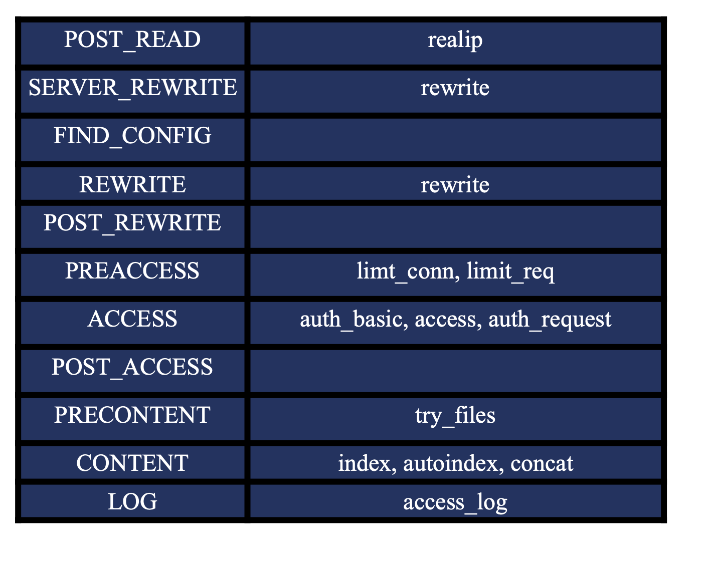

nginx的http模块
==========================================

配置块的嵌套情况
------------------------------------
.. code-block:: bash 

    http {
          upstream {}
          map {}
          geo {}
          server {}
          server{
            if () {}
            location {
            }
            location {
            }
          }

    }

指令的上下文
------------------------------------
指令的上下文是控制指令在哪个地方生效。这里按照官方网站的介绍一个。

这个例子说明log_format这个指令只能在http的片段内进行配置。

指令的合并
------------------------------------

- 值指令： 可以合并，子类可以从父类获取值的。可以向上覆盖的。
- 动作类指令： 不可以合并。

listen 指令
------------------------------------

参考： https://nginx.org/en/docs/http/ngx_http_core_module.html

这里提供几种listen方式

.. code-block:: text 

    listen unix:/var/run/nginx.sock;
    listen 127.0.0.1:8000;
    listen 127.0.0.1;
    listen 8000;
    listen \*:8000;
    listen [::]:8000 ipv6only=on;
    listen [::1];

接收请求事件模块
------------------------------------

操作系统会完成三次握手的， nginx通过epoll_wait读取到握手完毕包， nginx开始分配连接池 connection_poll_size:512 , nginx的http模块会给这个请求读取设置一个超时时间
client_header_time:60s, 然后分配一个缓冲区来读取header信息， client_header_buffer_size=1k， 接下来nginx继续通过epoll_wait获取header信息，存储在这个buffer中。

.. image:: ../images/nginx13.png

接收请求事件模块详细
------------------------------------

接收请求是2个大的部分， 一个是请求头部分，一个是请求body部分。 这里先说下第一个部分。

http模块处理请求，会先分配内存池的request_poll_size:4k，会解析行的， 如果第一行数据比较大， 原来的client_header_buffer_size 是放不下的，需要分配大内存。
large_clent_header_buffers: 4 8k 的大小。 继续解析行。 解析好后，uri变量就有值了， 接下来继续获取header信息 。 这个和uri使用共同的buffer。 

上面提到的几个参数重点这里说明下

- client_header_buffer_size: 默认是1k的， 也就是默认1k,如果uri和header信息这个1k不够存储的话才会使用large_client_header_buffers指定的大小。
- large_client_header_buffers: 默认4 8k， 如果8k能够存储下，那就只是用1个8k， 不够的话，2个，再不够就3个，但是最多使用4个8k的大小。如果超过4*8k大小那就返回414 url too large ,or 400.
- client_header_timeout: 默认60s，如果60s内没有读取完毕，就响应408.

正则表达式
------------------------------------ 
nginx的正则是标准的posix正则， 这里简单说下。

nginx的正则也是支持捕获组的，也支持捕获组命名的。 样例如下

.. code-block:: bash 

  rewrite^/admin/website/solution/(\d+)/change/uploads/(.*)\.(?<ext>png|jpg|gif|jpeg|bmp)$ /static/uploads/$2/$3.$ext last;

server_name 指令
------------------------------------
server_name 后面可以指定多个域名的， 第一个是主域名。
相关参数 server_name_in_redirect on表示在重定向的时候使用主域名而非用户访问过来的域名进行重定向。

补充说明: 

server_name 的指定的特殊情况。 "" 表示匹配没有传递host头部的请求， _表示匹配所有。 

.. literalinclude:: ../files/server_name.conf
   :encoding: utf-8
   :language: text 

测试下如下

.. code-block:: bash 

  # server_name_in_redirect on 的情况下  可以发现重定向的结果都是变成了主域名的host了。

  curl http://n-n1.linuxpanda.tech:8084/ -IL
  HTTP/1.1 302 Moved Temporarily
  Server: openresty/1.19.9.1
  Date: Mon, 06 Dec 2021 12:28:56 GMT
  Content-Type: text/html
  Content-Length: 151
  Location: http://n-n1.linuxpanda.tech:8084/redirect
  Connection: keep-alive

  curl http://n-n2.linuxpanda.tech:8084/ -IL
  HTTP/1.1 302 Moved Temporarily
  Server: openresty/1.19.9.1
  Date: Mon, 06 Dec 2021 12:29:44 GMT
  Content-Type: text/html
  Content-Length: 151
  Location: http://n-n1.linuxpanda.tech:8084/redirect
  Connection: keep-alive

使用正则创建变量
------------------------------------

.. literalinclude:: ../files/server_name_regex_var.conf
   :encoding: utf-8
   :language: text 

验证结果如下

.. code-block:: text 

  [root@zhaojiedi-elk-2 conf]# curl http://n-n2.linuxpanda.tech:8084/
  n-n2
  [root@zhaojiedi-elk-2 conf]# curl http://n-n1.linuxpanda.tech:8084/
  n-n1

server匹配顺序
------------------------------------

#. 精确匹配的
#. \*在前的泛域名 
#. \*在后的泛域名
#. 正则匹配的
#. default server 

其中default server 是在listen指定default的，那就是default server ， 如果没有。 那就是nginx加载的第一个server为default server 。 

nginx处理的11个阶段
------------------------------------

#. post_read 
#. server_rewrite 
#. find_config 
#. rewrite 
#. post_rewrite 
#. preaccess
#. access
#. post_access
#. precontent 
#. content 
#. log 

如何获取真实的用户ip地址。
------------------------------------

用户访问到我们的服务，可能经过多层代理后到达的， 一般情况下通过这几种方式获取用户真实ip地址。 

- http头部的X-Real-IP用于传递用户的真实ip地址。  
- http头部的X-Forwarded-For用于传递代理等中间ip地址。 一般最后就是用户ip地址。

帮助文档： https://nginx.org/en/docs/http/ngx_http_realip_module.html

real_ip_header 这个默认值是X-Real-IP的 

.. literalinclude:: ../files/real_ip.conf
   :encoding: utf-8
   :language: text 

测试结果如下

.. code-block:: bash 

  # 可以看到，real_ip_recursive on 开启后， set_real_ip_from指定的地址不会识别为real ip 的， 找到最后一个才算
  [root@zhaojiedi-elk-2 nginx]# curl http://n-realip.linuxpanda.tech -H "X-Forwarded-For: 1.1.1.1 2.2.2.2 10.157.1.2 10.157.1.3"
  Client real ip: 2.2.2.2
  [root@zhaojiedi-elk-2 nginx]# curl http://n-realip.linuxpanda.tech -H "X-Forwarded-For: 1.1.1.1 2.2.2.2 3.3.3.3 10.157.1.2 10.157.1.3"
  Client real ip: 3.3.3.3
  [root@zhaojiedi-elk-2 nginx]# curl http://n-realip.linuxpanda.tech -H "X-Forwarded-For: 10.157.1.2 10.157.1.3"
  Client real ip: 10.157.1.2

  # 可以看到，real_ip_recursive off 关闭后，只是简单的取最后一个的。
  [root@zhaojiedi-elk-2 nginx]# curl http://n-realip.linuxpanda.tech -H "X-Forwarded-For: 1.1.1.1 2.2.2.2 3.3.3.3 10.157.1.2 10.157.1.3"
  Client real ip: 10.157.1.3

如果拿到用户的ip如何使用
------------------------------------
nginx中可以通过变量访问到用户的真实ip地址。 remote_addr就是用户的ip地址。 有了这个用户ip可以做些限流等分流操作。

