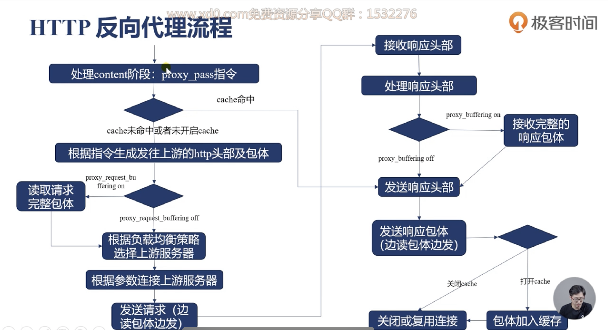
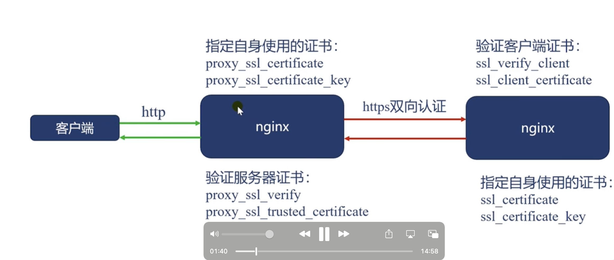
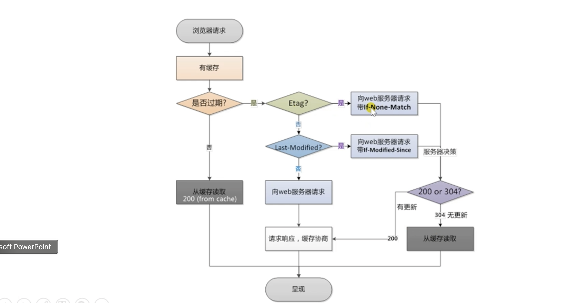
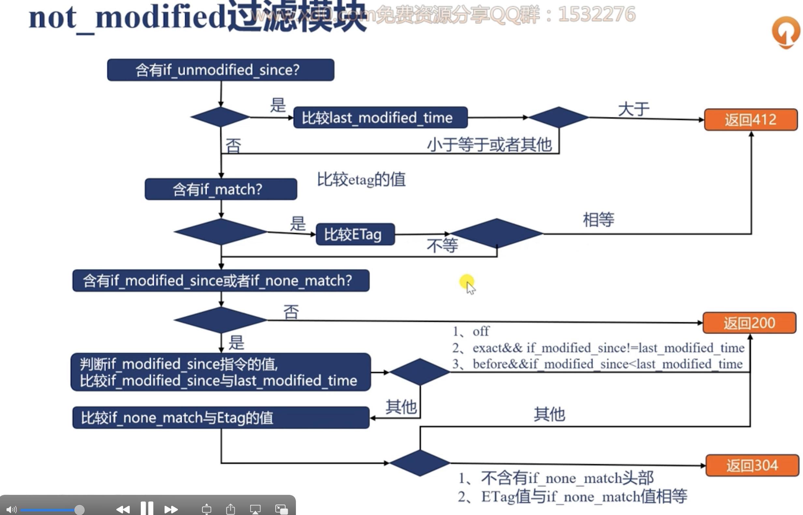
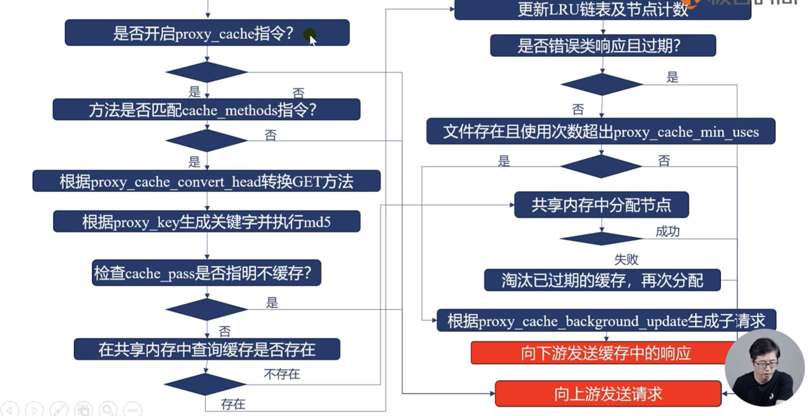
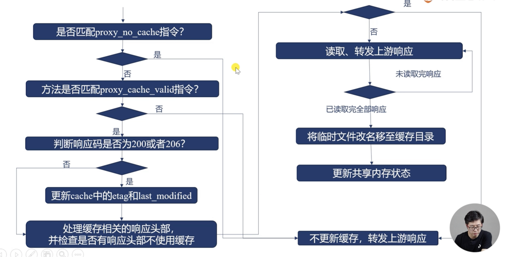
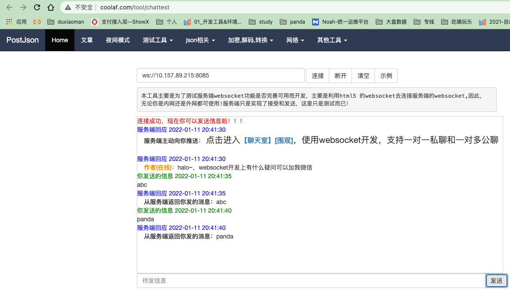
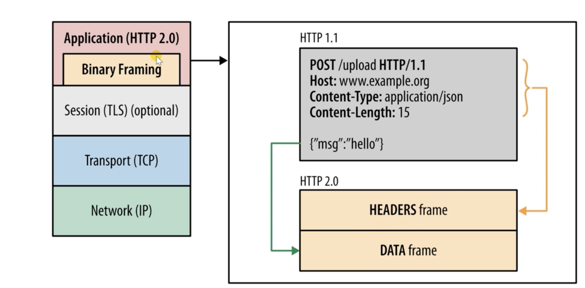

负载均衡
==========================================

nginx扩展方式
------------------------------------

- 基于url对功能进行分发
- 基于rr算法进行水平扩展
- 基于ip地址映射到特定ip或者集群

支持的反向代理协议
------------------------------------

- udp 
- tcp 
- memcached
- scgi 
- uwsgi 
- grpc 
- http 
- websocket 

负载均衡基础指令
------------------------------------

指定上游服务地址， 通过upstream指令指定， 内部通过server指令指定server。
server指定的地址， 可以是域名、ip、或者socket地址。不加端口默认是80端口。

官方文档: https://nginx.org/en/docs/http/ngx_http_upstream_module.html#upstream

server片段重要参数说明

- weight: 权重，默认是1 
- max_conns: 最大活动连接数量，默认是0，也就是不限制。
- max_fails: 最大失败次数，也就是在fail_timeout这个时间内，如果出现max_fails次数的话，对应的server就不会再次被选择。
- fail_timeout: 默认是10s
- backup: 备用， 如果所有的主都不可用才使用这个的。
- down: 表示这个机器永远不要调度。
- resolve: 解析域名到地址的。必须使用共享内存的。1.5.12之后才支持动态感知域名变化的。

对上游服务使用长连接
------------------------------------

降低ningx与上游服务器的建立关闭连接的消耗，提升吞吐量的同事降低延迟。

http1.1才支持， 需要加入如下设置。

.. code-block:: bash 

     proxy_http_version 1.1;
     proxy_set_header Connection "";

主要参数说明

- keepalive : 指定次数。
- keepalive_requests: 一个连接最多使用的req 
- keepalive_timeout: 一个连接最多使用的时间

轮训配置样例
------------------------------------

这里我先使用一个nginx启动了server， 测试如下

.. code-block:: bash 

    [root@zhaojiedi-elk-2 nginx]# curl 127.0.0.1:8001
    8001 s1
    [root@zhaojiedi-elk-2 nginx]# curl 127.0.0.1:8002
    8002 s2

配置样例

.. literalinclude:: ../files/rr.conf
   :encoding: utf-8
   :language: text

测试结果

.. code-block:: bash 

    [root@zhaojiedi-elk-2 conf]# curl http://n-rrups.linuxpanda.tech
    8001 s1
    [root@zhaojiedi-elk-2 conf]# curl http://n-rrups.linuxpanda.tech
    8002 s2
    [root@zhaojiedi-elk-2 conf]# curl http://n-rrups.linuxpanda.tech
    8001 s1
    [root@zhaojiedi-elk-2 conf]# curl http://n-rrups.linuxpanda.tech
    8001 s1
    [root@zhaojiedi-elk-2 conf]# curl http://n-rrups.linuxpanda.tech
    8002 s2

启用了keepalive 我们看下tcpdump 抓包的结果

.. code-block:: bash 

    [root@zhaojiedi-elk-2 ~]# tcpdump -i lo port 8001 -n
    tcpdump: verbose output suppressed, use -v or -vv for full protocol decode
    listening on lo, link-type EN10MB (Ethernet), capture size 262144 bytes

    16:20:09.756199 IP 127.0.0.1.42492 > 127.0.0.1.vcom-tunnel: Flags [S], seq 1693123386, win 43690, options [mss 65495,sackOK,TS val 299254666 ecr 0,nop,wscale 7], length 0
    le 7], length 0
    16:20:09.756220 IP 127.0.0.1.42492 > 127.0.0.1.vcom-tunnel: Flags [.], ack 1, win 342, options [nop,nop,TS val 299254666 ecr 299254666], length 0
    16:20:09.756262 IP 127.0.0.1.42492 > 127.0.0.1.vcom-tunnel: Flags [P.], seq 1:70, ack 1, win 342, options [nop,nop,TS val 299254666 ecr 299254666], length 69
    16:20:09.756266 IP 127.0.0.1.vcom-tunnel > 127.0.0.1.42492: Flags [.], ack 70, win 342, options [nop,nop,TS val 299254666 ecr 299254666], length 0
    16:20:09.756357 IP 127.0.0.1.vcom-tunnel > 127.0.0.1.42492: Flags [P.], seq 1:171, ack 70, win 342, options [nop,nop,TS val 299254666 ecr 299254666], length 170
    16:20:09.756361 IP 127.0.0.1.42492 > 127.0.0.1.vcom-tunnel: Flags [.], ack 171, win 350, options [nop,nop,TS val 299254666 ecr 299254666], length 0
    -----下面是第二次的。
    16:20:35.599901 IP 127.0.0.1.42492 > 127.0.0.1.vcom-tunnel: Flags [P.], seq 70:139, ack 171, win 350, options [nop,nop,TS val 299280510 ecr 299254666], length 69
    16:20:35.600018 IP 127.0.0.1.vcom-tunnel > 127.0.0.1.42492: Flags [P.], seq 171:341, ack 139, win 342, options [nop,nop,TS val 299280510 ecr 299280510], length 170
    16:20:35.600028 IP 127.0.0.1.42492 > 127.0.0.1.vcom-tunnel: Flags [.], ack 341, win 359, options [nop,nop,TS val 299280510 ecr 299280510], length 0

可以看到第一次是三次握手了， 但是是没有F的falgs的，也就是关闭连接的， 接下里curl的直接传输了。 

反向代理的hash算法
------------------------------------
对于ipv4地址使用前面3个字节作为关键字，对ipv6使用完整的地址。通过ip_hash 进行配置。

当然也可以通过hash key 方式配置非ip方式的。

官方文档： https://nginx.org/en/docs/http/ngx_http_upstream_module.html#ip_hash

配置ip_hash

.. literalinclude:: ../files/hash.conf
   :encoding: utf-8
   :language: text

验证1 ip_hash 

.. code-block:: bash 

    [root@zhaojiedi-elk-2 nginx]# curl http://n-hash.linuxpanda.tech:8084 -H "X-Forwarded-For: 1.1.1.1"
    8001 s1
    [root@zhaojiedi-elk-2 nginx]# curl http://n-hash.linuxpanda.tech:8084 -H "X-Forwarded-For: 1.1.1.1"
    8001 s1
    [root@zhaojiedi-elk-2 nginx]# curl http://n-hash.linuxpanda.tech:8084 -H "X-Forwarded-For: 1.1.1.1"
    8001 s1
    [root@zhaojiedi-elk-2 nginx]# curl http://n-hash.linuxpanda.tech:8084 -H "X-Forwarded-For: 1.1.1.1"
    8001 s1
    [root@zhaojiedi-elk-2 nginx]# curl http://n-hash.linuxpanda.tech:8084 -H "X-Forwarded-For: 1.1.1.1"
    8001 s1

验证1 hash key 

.. code-block:: bash

    [zhaojiedi_dxm@instance-pu4usb9a ~]$ curl http://n-hash.linuxpanda.tech:8084?username=abc
    8001 s1
    [zhaojiedi_dxm@instance-pu4usb9a ~]$ curl http://n-hash.linuxpanda.tech:8084?username=abc
    8001 s1
    [zhaojiedi_dxm@instance-pu4usb9a ~]$ curl http://n-hash.linuxpanda.tech:8084?username=abc
    8001 s1
    [zhaojiedi_dxm@instance-pu4usb9a ~]$ curl http://n-hash.linuxpanda.tech:8084?username=deaaa
    8002 s2
    [zhaojiedi_dxm@instance-pu4usb9a ~]$ curl http://n-hash.linuxpanda.tech:8084?username=deaaa
    8002 s2
    [zhaojiedi_dxm@instance-pu4usb9a ~]$ curl http://n-hash.linuxpanda.tech:8084?username=deaaa
    8002 s2

一致性hash算法
------------------------------------
通过hash key consistent 即可。 

连接做少的上游服务器
------------------------------------

upsteam共享内存
------------------------------------
使用共享内存可以将upstream定义的策略数据，状态数据放到共享内存中，对所有worker进程生效。

upsteam模块提供的变量
------------------------------------

- upstream_addr: 地址
- upstream_connect_time: 建立了解消耗时间
- upstream_header_time: 接收上游的头部需要的时间
- upstream_response_time: 完整耗时
- upstream_bytes_received: 响应长度
- upstream_response_length: 包体长度
- upstream_status: 上游的状态吗， 如果没有连接上，502
- upstream_cookie_名称: 上游返回的set_cookie取出的值。

http反向代理的处理流程
------------------------------------

proxy模块的基本使用
------------------------------------

这个模块是支持http和https协议2种类型的代理的， 
proxy 后面的url必须以http或者https开头， 接下来是域名、ip 、socket或者upstream名字。前面2个是可以添加端口的。 

如果url参数带不带uri差异是比较大的。 
- 不携带uri: 直接转发给上游
- 携带uri: 将location匹配的部分进行替换。

提前准备一个后端

.. code-block:: bash 

    server {
            listen 8001 ;
            location / {
                    return 200 '8001 s1\r\n uri=$uri \r\n';
            }
    }

.. literalinclude:: ../files/proxy.conf
   :encoding: utf-8
   :language: text

验证一下

.. code-block:: bash 

    # 不带uri方式的。 
    [root@zhaojiedi-elk-2 conf]# curl http://n-proxy.linuxpanda.tech:8084/a/b/c/d/e/f
    8001 s1
    uri=/a/b/c/d/e/f
    [root@zhaojiedi-elk-2 conf]# curl http://n-proxy.linuxpanda.tech:8084/a/b/c/def
    8001 s1
    uri=/a/b/c/def   

    # 带uri方式的。
    [root@zhaojiedi-elk-2 conf]# curl http://n-proxy.linuxpanda.tech:8084/a/b/c/def
    8001 s1
    uri=/panda/def
    [root@zhaojiedi-elk-2 conf]# curl http://n-proxy.linuxpanda.tech:8084/a/b/c/d/e/f
    8001 s1
    uri=/panda/d/e/f

修改向后端的请求行
------------------------------------

- proxy_method: 修改请求方法
- proxy_http_version: 修改协议版本。
- proxy_set_header field value: 修改请求头部。
- proxy_pass_request_header： 用户的header是否发送。
- proxy_pass_request_body: body是否发送
- proxy_set_body: 自定义body方式。

接收客户端请求的包体
------------------------------------
- proxy_request_buffering 控制收完在转发还是边收边转发。
- client_max_body_size: 仅仅对头部含有Content-Length有效超过最大长度后，返回413错误。
- client_body_temp_path: 临时文件存放目录，这个是存储body信息的。
- client_body_in_file_only : 请求的包体是否保留的文件中，on必须写的， clean: 处理完毕后删除， off: 非常小，buffer_size 如果够的话，就不写了。
- client_body_timeout : 两次读取body的最大时延，返回418错误。

向上游建立连接
------------------------------------

- proxy_connect_timeout 建立连接，如果超时，502
- proxy_next_upstream : 特定错误后，可以换一个机器进行调度响应。
- proxy_socket_keepalive: 保持连接。
- keepalive: 控制数量
- keepalive_requests: 控制连接复用次数
- proxy_bind: 修改源地址。如果非本机地址，需要transparent的参数辅助的。 
- proxy_ignore_client_abort: 客户端和nginx如果取消了， nginx和后端的连接是否断开。
- proxy_send_timeout : 发送请求的超时时间。

接收上游的响应头部
------------------------------------

- proxy_buffer_size 是用来存放对应响应头部的，如果比较大，errlog会出现upstream send too big header。
- proxy_buffering ： 接收完整的响应包体，这个基本同proxy_request_buffering.

接收上游的包体
------------------------------------

- proxy_buffers 这个用于存放上游的http包体大小，8 8k参数是如果8k足够就只分配1个8k的， 不够继续分配，最多8个8k。
- proxy_buffering: 
- proxy_max_temp_file_size: 写入磁盘的文件的最大值。
- proxy_temp_file_write_size: 每次写入字节限制。
- proxy_temp_path: 指定临时文件目录和存储级别。
- proxy_busy_buffers_size: 及时转发包体

接受上游网络速度相关指令
------------------------------------

- proxy_read_timeout: 2次读取超时时间。
- proxy_limit_rate: 读取上游的速率。 

包体持久化
------------------------------------

- proxy_store_access: 定义临时文件持久化， 权限设置。
- proxy_store: 可以使用变量控制存放位置。

加工响应头部
------------------------------------

- proxy_ignore_header: 禁用特定字段。
- proxy_hide_header: 不转发某些头部。
- porxy_pass_header： 允许哪些头部发送。
- proxy_cookie_domain: 修改域名
- proxy_cookie_path: 修改path
- proxy_redirect: 重定向url 

上游返回错误的处理办法
------------------------------------

- proxy_next_upstream: 在没有想客户端发送任何内容的时候，就错误的才重新选择新的机器。 
- proxy_next_upstream_timeout: 重试的时间
- proxy_next_upstream_tries: 重试的次数。
- proxy_intercept_erros: 是否拦截上游失败响应，如果上游响应>=300的视乎，启用这个选项的话， error_page就会生效了。 

准备工作

.. code-block:: bash 

    [root@zhaojiedi-elk-2 nginx]# cat /root/nginx/conf/sites/s1.conf
    server {
        listen 8001 ;
        location / {
            return 200 '8001 s1\r\n uri=$uri \r\n';
        }
    }
    [root@zhaojiedi-elk-2 nginx]# cat /root/nginx/conf/sites/s2.conf
    server {
        listen 8002;
        location / {
            return 200 '8002 s2 \r\n';
        }
    }
    [root@zhaojiedi-elk-2 nginx]# cat /root/nginx/conf/sites/s3.conf
    server {
        listen 8003;
        location / {
            return 502 ;
        }
    }

openrestry配置如下

.. literalinclude:: ../files/proxyc.conf
   :encoding: utf-8
   :language: text

验证效果

.. code-block:: bash 

    [root@zhaojiedi-elk-2 nginx]# curl http://n-proxyc.linuxpanda.tech:8084/
    8001 s1
    uri=/
    [root@zhaojiedi-elk-2 nginx]# curl http://n-proxyc.linuxpanda.tech:8084/
    8002 s2
    # 803是返回502的， 但是我们配置了next的，会调度到别的实例然后拿到结果。
    [root@zhaojiedi-elk-2 nginx]# curl http://n-proxyc.linuxpanda.tech:8084/
    8001 s1
    uri=/
    [root@zhaojiedi-elk-2 nginx]# tail -n 10 logs/access.log
    porxy_host="ups" proxy_port="80" upstream_addr="127.0.0.1:8001" upstream_status="200"
    porxy_host="ups" proxy_port="80" upstream_addr="127.0.0.1:8002" upstream_status="200"
    porxy_host="ups" proxy_port="80" upstream_addr="127.0.0.1:8003, 127.0.0.1:8001" upstream_status="502, 200"

ssl使用场景和双向认证
------------------------------------

官方文档： https://nginx.org/en/docs/http/ngx_http_ssl_module.html#directives

几个主要连接相关变量

- ssl_client_serial: 连接上的客户端序列号。
- ssl_early_data: 在tls3使用early data 且握手为完成返回1 ，否则返回空。
- ssl_client_verify: 验证失败返回failed:原因，成功返回Success.
- ssl_session_reused: 如果session复用，返回r,否则为. 。

准备相关证书

.. code-block:: bash 

    # 这里不多弄具体证书创建问题， 需要几个文件，
    ca的pem文件
    n-ssl1.linuxpanda.tech.key n-ssl1.linuxpanda.tech.crt
    n-ssl2.linuxpanda.tech.key n-ssl2.linuxpanda.tech.crt

    # 具体操作可以参考： https://www.linuxpanda.tech/en/latest/%E6%9D%82%E9%A1%B9/CA%E7%9A%84%E6%90%AD%E5%BB%BA.html
    # 或者： https://www.cnblogs.com/zhaojiedi1992/p/zhaojiedi_linux_011_ca.html

nginx配置

.. literalinclude:: ../files/ssl1.conf
   :encoding: utf-8
   :language: text

openrestry配置

.. literalinclude:: ../files/ssl1.conf
   :encoding: utf-8
   :language: text

验证测试

.. code-block:: bash 

    [root@zhaojiedi-elk-2 sites]# curl http://n-ssl2.linuxpanda.tech:8012/
    ssl_early_data= ; ssl_client_verify=SUCCESS;

浏览器缓存与nginx缓存
------------------------------------
    
浏览器缓存
    优点： 没有网络消耗，速度最快，即使有网络消耗也比较小。
    缺点： 仅仅提升一个用户体验。
nginx缓存： 
    优点： 提升所有用户体验，有效降低后端负载，通过304减少与上游的流量消耗。
    缺点： 用户仍然保持网络消耗

建议同时使用浏览器缓存和nginx缓存。

etag
------------------------------------
根据文件的修改时间和大小生成。

if-none-match
------------------------------------
它的原理是这样的，当浏览器请求服务器的某项资源(A)时, 服务器根据A算出一个哈希值(3f80f-1b6-3e1cb03b)并通过 ETag 返回给浏览器，
浏览器把"3f80f-1b6-3e1cb03b" 和 A 同时缓存在本地，当下次再次向服务器请求A时，会通过类似 If-None-Match: "3f80f-1b6-3e1cb03b" 
的请求头把ETag发送给服务器，服务器再次计算A的哈希值并和浏览器返回的值做比较，如果发现A发生了变化就把A返回给浏览器(200)，如果发现A没有变化就给浏览器返回一个304未修改。
这样通过控制浏览器端的缓存，可以节省服务器的带宽，因为服务器不需要每次都把全量数据返回给客户端。

具体参考： https://developer.mozilla.org/zh-CN/docs/Web/HTTP/Headers/If-None-Match

if-modified-since头部
------------------------------------
如果没有超过日期，就返回304，超过就返回200，具体内容就返回。

.. warning:: 如何和if-None-Match一同使用的时候，这个since是不生效的，除非服务器不支持Match的。

nginx判定缓存是否过期
------------------------------------

expire指令： 

- max: 最大的值。cache-control基本10年。
- off,不添加或者修改过期和cache-control字段。
- epoch 不设置缓存
- time 设置具体时间， @18h30m 

准备几个文件

.. code-block:: bash 

    [root@zhaojiedi-elk-2 html]# for i in $(seq 1 7) ; do mkdir dir$i;  echo "this is dir$i" >> dir$i/index.html; done
    [root@zhaojiedi-elk-2 html]# tree
    .
    ├── 50x.html
    ├── dir1
    │   └── index.html
    ├── dir2
    │   └── index.html
    ├── dir3
    │   └── index.html
    ├── dir4
    │   └── index.html
    ├── dir5
    │   └── index.html
    ├── dir6
    │   └── index.html
    ├── dir7
    │   └── index.html
    └── index.html

nginx配置样例

.. literalinclude:: ../files/cache.conf
   :encoding: utf-8
   :language: text

这里对集中情况进行验证

.. code-block:: bash

    # 案例1，max， 可以看到结果max-age是10年的
    [root@zhaojiedi-elk-2 conf]# curl http://n-cache.linuxpanda.tech:8084/dir1/index.html -IL
    HTTP/1.1 200 OK
    Server: openresty/1.19.9.1 (no pool)
    Date: Tue, 11 Jan 2022 03:49:14 GMT
    Content-Type: text/html
    Content-Length: 13
    Last-Modified: Tue, 11 Jan 2022 03:45:37 GMT
    Connection: keep-alive
    ETag: "61dcfd61-d"
    Expires: Thu, 31 Dec 2037 23:55:55 GMT
    Cache-Control: max-age=315360000
    Accept-Ranges: bytes

    #案例2 我当前是11:50的，我设置15h30m 具体这个时间大概220分钟=（3小时 40分钟）
    [root@zhaojiedi-elk-2 conf]# curl http://n-cache.linuxpanda.tech:8084/dir2/index.html -IL
    HTTP/1.1 200 OK
    Server: openresty/1.19.9.1 (no pool)
    Date: Tue, 11 Jan 2022 03:50:00 GMT
    Content-Type: text/html
    Content-Length: 13
    Last-Modified: Tue, 11 Jan 2022 03:45:37 GMT
    Connection: keep-alive
    ETag: "61dcfd61-d"
    Expires: Tue, 11 Jan 2022 07:30:00 GMT
    Cache-Control: max-age=13200
    Accept-Ranges: bytes

    #案例3 根据modify修改时间，加一个时间。
    [root@zhaojiedi-elk-2 conf]# curl http://n-cache.linuxpanda.tech:8084/dir3/index.html -IL
    HTTP/1.1 200 OK
    Server: openresty/1.19.9.1 (no pool)
    Date: Tue, 11 Jan 2022 03:52:56 GMT
    Content-Type: text/html
    Content-Length: 13
    Last-Modified: Tue, 11 Jan 2022 03:45:37 GMT
    Connection: keep-alive
    ETag: "61dcfd61-d"
    Expires: Wed, 12 Jan 2022 03:45:37 GMT
    Cache-Control: max-age=85961
    Accept-Ranges: bytes

    [root@zhaojiedi-elk-2 conf]# ll ../html/dir3/index.html
    -rw-r--r-- 1 root root 13 Jan 11 11:45 ../html/dir3/index.html

    # 案例4 max-age=0
    [root@zhaojiedi-elk-2 conf]# curl http://n-cache.linuxpanda.tech:8084/dir4/index.html -IL
    HTTP/1.1 200 OK
    Server: openresty/1.19.9.1 (no pool)
    Date: Tue, 11 Jan 2022 03:53:43 GMT
    Content-Type: text/html
    Content-Length: 13
    Last-Modified: Tue, 11 Jan 2022 03:45:37 GMT
    Connection: keep-alive
    ETag: "61dcfd61-d"
    Expires: Tue, 11 Jan 2022 03:53:43 GMT
    Cache-Control: max-age=0
    Accept-Ranges: bytes
    # 案例5 设置负数表示no-cache
    [root@zhaojiedi-elk-2 conf]# curl http://n-cache.linuxpanda.tech:8084/dir5/index.html -IL
    HTTP/1.1 200 OK
    Server: openresty/1.19.9.1 (no pool)
    Date: Tue, 11 Jan 2022 03:54:39 GMT
    Content-Type: text/html
    Content-Length: 13
    Last-Modified: Tue, 11 Jan 2022 03:45:37 GMT
    Connection: keep-alive
    ETag: "61dcfd61-d"
    Expires: Tue, 11 Jan 2022 03:54:38 GMT
    Cache-Control: no-cache
    Accept-Ranges: bytes
    # 案例6 
    [root@zhaojiedi-elk-2 conf]# curl http://n-cache.linuxpanda.tech:8084/dir6/index.html -IL
    HTTP/1.1 200 OK
    Server: openresty/1.19.9.1 (no pool)
    Date: Tue, 11 Jan 2022 03:55:34 GMT
    Content-Type: text/html
    Content-Length: 13
    Last-Modified: Tue, 11 Jan 2022 03:45:37 GMT
    Connection: keep-alive
    ETag: "61dcfd61-d"
    Expires: Thu, 01 Jan 1970 00:00:01 GMT
    Cache-Control: no-cache
    Accept-Ranges: bytes

not_modified
------------------------------------
客户端拥有缓存，但是不确定缓存是否过期，请求闯入if-none-match或者if-modified-since 头部， 该模块通过将改值与响应中的last-modified值进行比较，
决定是否返回200还是仅仅302 notmodified头部。

nginx缓存：定义存放的载体
------------------------------------

- proxy_cache zone： 定义使用哪个zone
- proxy_cache_path: 定义zone

proxy_cache_path指令详细参数

- path： 定义目录
- level: 目录级别
- use_temp_path: 定义临时目录
- keys_zone: name定义共享内存名字，size是共享内存大小 1MB大约可以存放8k key 
- inactive: 在特定时间没有被访问就会被淘汰掉， 默认10min
- max_size: 设置最大的缓存文件大小，超出后按照lru淘汰。
- manager_files: 淘汰的最大文件数量 默认100 
- manager_sleep: 淘汰一次后的休眠时间
- manager_threshold: 执行一次的最大耗时，默认50ms
- loader_files: 载入磁盘文件到共享内存的批处理文件数量，默认100
- loader_sleep: 执行一次缓存文件到共享内存后，进程的休眠时间。
- loader_threshold: 每次载入文件的最大耗时，默认50ms

定义缓存的key
------------------------------------

proxy_cache_key : 可以使用变量，定义缓存的key

缓存什么请求
------------------------------------
proxy_cache_valid: 

不缓存什么内存
------------------------------------

- proxy_no_cache : 参数为真的时候，响应不存入缓存
- porxy_cache_bypass: 参数为真，不使用缓存内容。

upstrream_cache_status变量
------------------------------------

- MISS 未命中
- HIT 命中缓存
- EXPIRED 缓存已经过期
- STALE 命中陈旧缓存
- UPDATING 内容陈旧单正在更新
- REVALIDATED nginx验证陈旧内容依然有效
- BYPASS 响应是从原始服务器获得的。

nginx后端配置

.. literalinclude:: ../files/s4.conf
   :encoding: utf-8
   :language: text

openrestry 配置

.. literalinclude:: ../files/cachec.conf
   :encoding: utf-8
   :language: text

验证结果

.. code-block:: bash 

    curl http://n-cachec.linuxpanda.tech:8084/index.html  -IL
    HTTP/1.1 200 OK
    Server: openresty/1.19.9.1 (no pool)
    Date: Tue, 11 Jan 2022 07:43:32 GMT
    Content-Type: text/html
    Content-Length: 612
    Connection: keep-alive
    Last-Modified: Mon, 29 Nov 2021 07:50:00 GMT
    ETag: "61a48628-264"
    X-Cache-Status: MISS
    Accept-Ranges: bytes

    [root@zhaojiedi-elk-2 conf]# curl http://n-cachec.linuxpanda.tech:8084/index.html  -IL
    HTTP/1.1 200 OK
    Server: openresty/1.19.9.1 (no pool)
    Date: Tue, 11 Jan 2022 07:43:35 GMT
    Content-Type: text/html
    Content-Length: 612
    Connection: keep-alive
    Last-Modified: Mon, 29 Nov 2021 07:50:00 GMT
    ETag: "61a48628-264"
    X-Cache-Status: HIT
    Accept-Ranges: bytes

    [root@zhaojiedi-elk-2 sites]# !tree
    tree /root/openresty/nginx/cache/
    /root/openresty/nginx/cache/
    └── 0a
        └── 0d
            └── 3fc7ad9511bc116105001aa24d260d0a

    2 directories, 1 file
    [root@zhaojiedi-elk-2 sites]# cat /root/openresty/nginx/cache/0a/0d/3fc7ad9511bc116105001aa24d260d0a

缓存流程 发起请求部分
------------------------------------

缓存流程 接手上游响应
------------------------------------

如何减轻上游压力
------------------------------------

1. 合并回源请求 proxy_cache_lock on 同一个时间只能有1个请求。 proxy_cache_lock_timeout: 等待第一个多久， proxy_cache_lock_age: 上一个请求的超时时间。
2. 使用久缓存返回 proxy_cache_use_stale updating proxy_cache_backgroupd_update on 。
3. proxy——cache_revalidate on 在请求上游的时候会带header if-modified_since if-none-match等，没有变化就是304减少传输。

及时清理缓存
------------------------------------
官方的开源是不支持的，plus nginx是支持的， 这里有个模块，可以编译进来。
https://github.com/FRiCKLE/ngx_cache_purge

七层反向代理对照表
------------------------------------

redis反向代理
------------------------------------
将http请求转换为redis协议中的get请求转发到上游memcached服务中。

配置如下

.. literalinclude:: ../files/redis.conf
   :encoding: utf-8
   :language: text

样例验证

.. code-block:: bash 

    [root@zhaojiedi-elk-2 sites]# curl 'http://n-redis.linuxpanda.tech:8084/set?key=k1&val=v1'
    +OK
    [root@zhaojiedi-elk-2 sites]# curl 'http://n-redis.linuxpanda.tech:8084/get?key=k1'
    $2
    v1

nginx实现websocket代理
------------------------------------

proxy模块提供
官方参考 https://nginx.org/en/docs/http/websocket.html

核心配置片段
.. code-block:: bash 

    proxy_http_version 1.1;
    proxy_set_header Upgrade $http_upgrade;
    proxy_set_header Connection "upgrade";

配置

.. literalinclude:: ../files/websocket.conf
   :encoding: utf-8
   :language: text

验证

如果配置证书的话， 就是wss协议了。 这个样例仅仅支持ws协议。

使用分片提升效率
------------------------------------
处理大文件的时候，每次都请求全部大小是很消耗资源的事情， 通过range方式配合slice方式即可请求特定部分。

准备一个大文件

.. code-block:: bash 

    dd if=/dev/zero of=big.avi bs=1M count=88

配置一个上游服务

就是简单配置的静态集群的。

配置openrestry

.. literalinclude:: ../files/slice.conf
   :encoding: utf-8
   :language: text

验证下

.. code-block:: bash 

    [root@zhaojiedi-elk-2 nginx]# curl http://n-slice.linuxpanda.tech:8084/big.avi -r 100-200
    [root@zhaojiedi-elk-2 nginx]# tail -n 2 /root/openresty/nginx/logs/access.log
    10.157.89.215 - - [12/Jan/2022:10:47:08 +0800] "GET /big.avi HTTP/1.1" 502 173 "-" "curl/7.29.0" "-"request_filename=/root/openresty/nginx/html/big.avi document_root=/root/openresty/nginx/html realpath_root=/root/openresty/nginx/html
    10.157.89.215 - - [12/Jan/2022:10:47:55 +0800] "GET /big.avi HTTP/1.1" 206 101 "-" "curl/7.29.0" "-"request_filename=/root/openresty/nginx/html/big.avi document_root=/root/openresty/nginx/html realpath_root=/root/openresty/nginx/html
    [root@zhaojiedi-elk-2 nginx]# tail -n 2 /root/nginx/logs/access.log
    127.0.0.1 - - [11/Jan/2022:15:47:39 +0800] "GET /index.html HTTP/1.0" 200 612 "-" "curl/7.29.0"
    127.0.0.1 - - [12/Jan/2022:10:47:55 +0800] "GET /big.avi HTTP/1.0" 200 92274688 "-" "curl/7.29.0"

缓存优化-文件打开
------------------------------------

- open_file_cache: 打开文件缓存的个数，超过的个数使用lru算法。
- open_file_cache_valid: 文件缓存的有效时间。
- open_file_cache_errors: 是否缓存文件查询的错误信息。默认off.
- open_file_cache_min_uses: 具体没有看明白文档。

文件缓存都缓存什么内容

- 文件句柄
- 文件修改时间
- 文件大小
- 文件查询时候的错误信息(比如文件不能存在，或者没有权限)
- 目录是否存在

配置如下

.. literalinclude:: ../files/openfilecache.conf
   :encoding: utf-8
   :language: text

验证

.. code-block:: bash 

    # 这里找到对应nginx的work进程，看看这个具体进程的系统调用
    [root@zhaojiedi-elk-2 ~]# strace -p 14160
    strace: Process 14160 attached
    # 默认卡在wait这个地方，等待连接请求
    epoll_wait(13,[{EPOLLIN, {u32=44802384, u64=44802384}}], 512, -1) = 1
    # 收到一个请求
    accept4(11, {sa_family=AF_INET, sin_port=htons(40254), sin_addr=inet_addr("10.157.89.215")}, [112->16], SOCK_CLOEXEC|SOCK_NONBLOCK) = 4
    epoll_ctl(13, EPOLL_CTL_ADD, 4, {EPOLLIN|EPOLLRDHUP|EPOLLET, {u32=44803080, u64=44803080}}) = 0
    epoll_wait(13, [{EPOLLIN, {u32=44803080, u64=44803080}}], 512, 60000) = 1
    # 接受头部
    recvfrom(4, "GET / HTTP/1.1\r\nUser-Agent: curl"..., 1024, 0, NULL, NULL) = 100
    # 写响应
    writev(4, [{iov_base="HTTP/1.1 200 OK\r\nServer: openres"..., iov_len=255}], 1) = 255
    # 发送文件body
    sendfile(4, 5, [0] => [1129], 1129)     = 1129
    lstat("/root", {st_mode=S_IFDIR|0550, st_size=4096, ...}) = 0
    lstat("/root/openresty", {st_mode=S_IFDIR|0755, st_size=4096, ...}) = 0
    lstat("/root/openresty/nginx", {st_mode=S_IFDIR|0755, st_size=4096, ...}) = 0
    lstat("/root/openresty/nginx/html", {st_mode=S_IFDIR|0755, st_size=4096, ...}) = 0
    write(3, "10.157.89.215 - - [12/Jan/2022:1"..., 232) = 232
    setsockopt(4, SOL_TCP, TCP_NODELAY, [1], 4) = 0
    epoll_wait(13, [{EPOLLIN|EPOLLRDHUP, {u32=44803080, u64=44803080}}], 512, 65000) = 1
    recvfrom(4, "", 1024, 0, NULL, NULL)    = 0
    close(4)                                = 0
    epoll_wait(13,

http2主要特性
------------------------------------

传输数据量大幅减少
    二进制数据传输
    标头压缩

多路复用
    消息优先级

服务器消息推送
    并行推送

http2核心概念
------------------------------------

- 连接： 1个tcp连接
- 流：一个双向流
- 消息： 对应http的请求或者响应
- 数据帧： 最小单位，以二进制压缩格存放http1中的内容。

协议分层和多路复用
------------------------------------

传输是无序的，接收的时候组装。

优先级1-255

http2推送文件
------------------------------------
- http2_push_preload 跟进header指定， 上游服务器可以生成header.
- http2_push 推送哪个url 
- http2_push_max_number: 推送最大数
- http2_recv_timeout: 如果超过这个时间没有收到请求就关闭
- http2_idle_timeout: 超过这个时间，就关闭连接
- http2_max_concurrent_pusher: 最大推送个数
- http2_max-concurrent_streams: 最大并发流个数
- http2_max_field_size： header最大大小
- http2_max_requests: 一个连接最大请求个数

nginx反向代理grpc
------------------------------------

stream模块处理的7个阶段

- POST_ACCEPT 
- PREACCESS
- ACCESSS
- SSL 
- PREFEAD
- CONTENT 
- LOG 
  
nginx代理4层样例
------------------------------------

proxy_protocol 协议
------------------------------------

v1协议： 
    proxy tcp4 ip1 ip2 port1 port2 \r\n 
v2协议： 
    签名+ version_command + 地址族+ 长度

udp反向代理
------------------------------------

