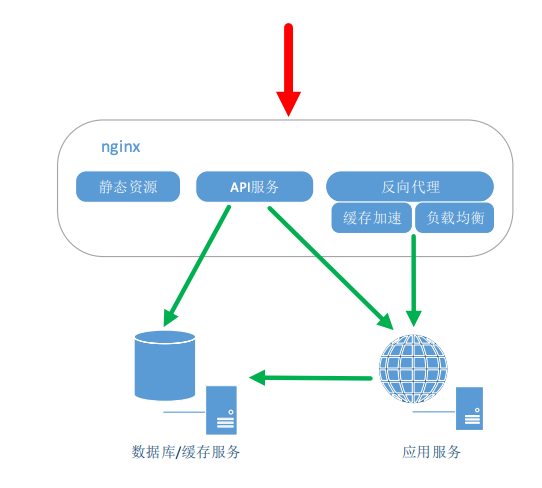
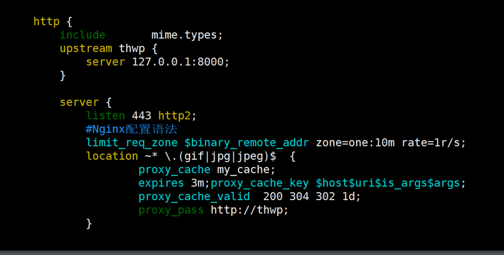
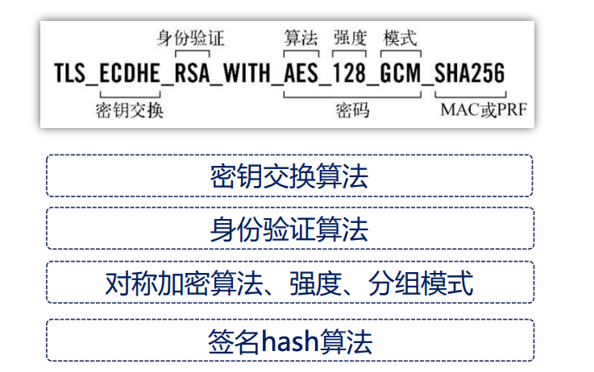
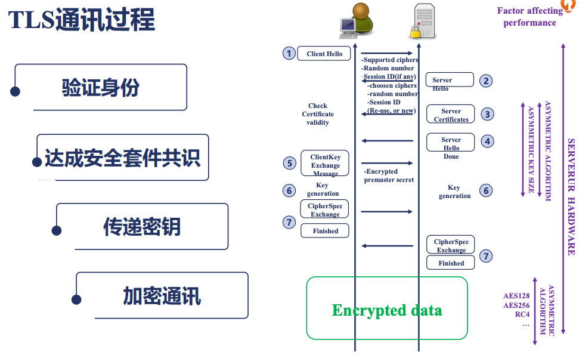

初识nginx
==========================================

主要使用场景
--------------------------------

- 静态资源服务
- 反向代理服务
- api服务

nginx为何出现
---------------------------

- 互联网的跨苏普及
- 摩尔定律性能提升
- 低效的apache 一个连接对应一个进程

nginx的优点
---------------------------

- 高并发，高性能
- 可扩展性比较好
- 高可靠性
- 热部署
- BSD许可证

nginx组成
---------------------------

- nginx二进制可执行文件
- nginx.conf配置文件
- access.log 访问日志
- error.log 错误日志

常见nginx及其分支
---------------------------

标准分支
~~~~~~~~~~~~~~~~~~~~~~~~~~~~~~~~~~

- 开源nginx: nginx.org 
- 商业版本： nginx.com 

tengine
~~~~~~~~~~~~~~~~~~~~~~~~~~~~~~~~~~
tengine是淘宝发起的web服务器项目

openrestry
~~~~~~~~~~~~~~~~~~~~~~~~~~~~~~~~~~
张亦春维护的。

- 开源版本 openresty.org 
- 商业版本 openresty.com 

nginx配置语法
---------------------------

- 配置文件由指令与指令块构成
- 每个指令以分号结尾，指令和参数之间空格分隔。
- 指令块以{}大括号将多条指令组织在一起。
- include 语句运行组合多个配置文件来提升可维护性。
- 使用#符号表示注释，提升可读性。
- 使用$符号使用变量。
- 部分指令是支持正则表达式的。

配置样例
---------------------------

nginx 编译安装
---------------------------

.. code-block:: bash 

    wget https://nginx.org/download/nginx-1.20.2.tar.gz
    tar xf nginx-1.20.2.tar.gz
    cd nginx-1.20.2/
    yum install gcc
    ./configure --prefix=/root/nginx
    make && make install
    cd /root/nginx
    ./sbin/nginx
    ps axu |grep nginx

nginx命令行
---------------------------

重载配置文件
~~~~~~~~~~~~~~~~~~~~~~~~~~~~~~~~~~

.. code-block:: bash
    vim conf/nginx.conf 修改端口， 
    ./sbin/nginx -s reload 

热部署
~~~~~~~~~~~~~~~~~~~~~~~~~~~~~~~~~~
热部署是保证在一个nginx状态下，完成不影响业务的前提下更新nginx从一个版本到另一个版本的过程。

.. code-block:: bash 
    # 备份下老版本的
    mv sbin/nginx  sbin/nginx.old
    # 弄新版本nginx过来
    cp /root/n2/sbin/nginx  sbin/nginx
    [root@zhaojiedi-elk-2 nginx]# ps aux |grep nginx |grep master
    root     33924  0.0  0.0  20708  1380 ?        Ss   15:52   0:00 nginx: master process ./sbin/nginx
    # 发送热部署信号
    kill -USR2 33924
    # 检查查看有2个master进程和对应的work进程
    [root@zhaojiedi-elk-2 nginx]# ps aux |grep nginx
    root     33924  0.0  0.0  20708  1380 ?        Ss   15:52   0:00 nginx: master process ./sbin/nginx
    nobody   35468  0.0  0.0  33380  1484 ?        S    15:55   0:00 nginx: worker process
    root     40861  0.0  0.0  20576  1604 ?        S    16:00   0:00 nginx: master process ./sbin/nginx
    nobody   40862  0.0  0.0  33264  1620 ?        S    16:00   0:00 nginx: worker process
    root     41217  0.0  0.0 112812   976 pts/1    S+   16:01   0:00 grep --color=auto nginx
    # 通知老的进行关闭自己work进程
    kill -WINCH 33924
    # 确认老的work关闭
    [root@zhaojiedi-elk-2 nginx]# ps aux |grep nginx
    root     33924  0.0  0.0  20708  1380 ?        Ss   15:52   0:00 nginx: master process ./sbin/nginx
    root     40861  0.0  0.0  20576  1604 ?        S    16:00   0:00 nginx: master process ./sbin/nginx
    nobody   40862  0.0  0.0  33264  1620 ?        S    16:00   0:00 nginx: worker process
    root     41782  0.0  0.0 112812   972 pts/1    S+   16:02   0:00 grep --color=auto nginx
    # 这里可以在发送一个kill -9 信号关闭老的，或者留着， 然后发送reload进行重启。

切割日志文件
~~~~~~~~~~~~~~~~~~~~~~~~~~~~~~~~~~

.. code-block:: bash 

    mv access.log access.log.$(date "+%F")
    ./sbin/nginx -s reopen 

SSL发展
---------------------------

发展过程

ssl3.0 => tls1.0 => tls1.1 => tls1.2 => tls1.3 

密码套件

证书类型

域名验证 => 组织验证 => 扩展验证

SSL通信过程
---------------------------

配置证书
---------------------------

一般情况下会通过nginx的include来包含各个域名的配置文件， 
通过include sites/*.conf 这种片段来包含sites目录下各个配置文件， 具体配置文件里面是每个域名的配置。

.. code-block:: bash 

    # 老的配置
    [root@zhaojiedi-elk-2 nginx]# cat sites/nx.linuxpanda.tech.conf
    server{
        listen 8083 ;
        server_name nx.linuxpanda.tech;
        alias /html/nx;
    }

    # 申请证书，一般是2个文件， crt 一个 key一个， 一个是公钥的一个是私钥的。 
    [root@zhaojiedi-elk-2 nginx]# cat sites/nx.linuxpanda.tech.conf
    server{
        listen 8083 ;
        listen 8443 ssl;
        server_name nx.linuxpanda.tech;
        alias /html/nx;
        ssl_certificate     ssl/nx.linuxpanda.tech.crt;
            ssl_certificate_key ssl/nx.linuxpanda.tech.key;
    }
        
重载下nginx即可生效

.. note:: 如果你要使用免费证书的话，这里建议大家选择国外的证书免费提供商，国内的太绕了，需要填写和登记的太多了。 

openresty+lua样例
---------------------------

.. code-block:: bash 

    #添加如下片段
        location /lua {
            default_type text/html;
                    content_by_lua_block {
                    ngx.say("
hello, world
")
                }
        }
    # 重载一下
    [root@zhaojiedi-elk-2 openresty]# curl http://10.157.89.215:8084/lua
    
hello, world

